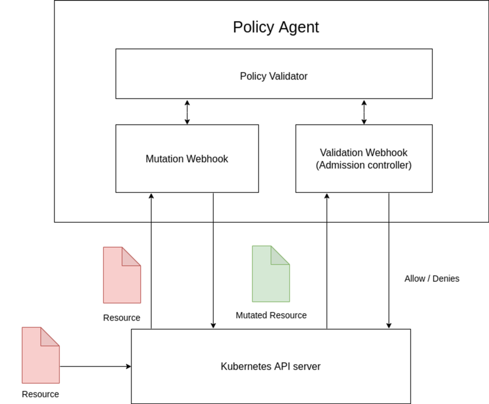

# Policy CRD

This is the main resource and it is used to define policies which will be evaluated by the policy agent.

It uses [OPA Rego Language](https://www.openpolicyagent.org/docs/latest/policy-language) to evaluate the entities.

## Schema

You can find the cutom resource schema [here](../config/crd/bases/pac.weave.works_policies.yaml)


## Policy Library

Here is the Weaveworks [Policy Library](https://github.com/weaveworks/policy-library)

## Tenant Policy

It is used in [Multi Tenancy](https://docs.gitops.weave.works/docs/enterprise/multi-tenancy/) feature in [Weave GitOps Enterprise](https://docs.gitops.weave.works/docs/enterprise/intro/)

Tenant policies has a special tag `tenancy`. 

## Mutating Resources




Starting from version `v2.2.0`, the policy agent will support mutating resources.

To enable mutating resources policies must have field `mutate` set to `true` and the rego code should return the `violating_key` and the `recommended_value` in the violation response. The mutation webhook will use the `violating_key` and `recommended_value` to mutate the resource and return the new mutated resource.

Example 

```
result = {
    "issue_detected": true,
    "msg": sprintf("Replica count must be greater than or equal to '%v'; found '%v'.", [min_replica_count, replicas]),
    "violating_key": "spec.replicas",
    "recommended_value": min_replica_count
}
```

